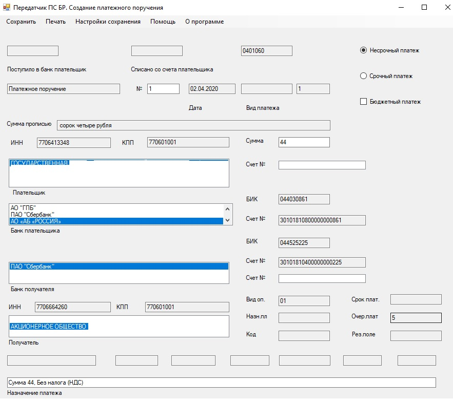
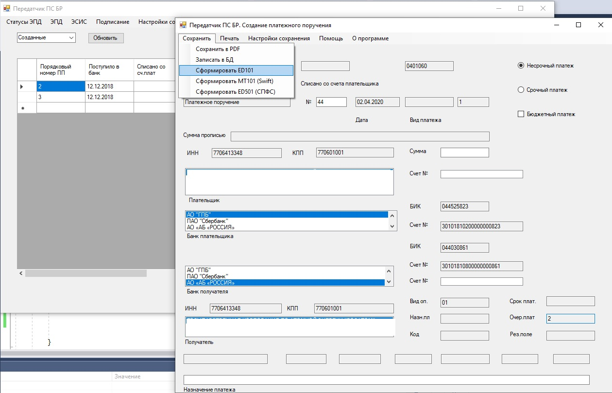
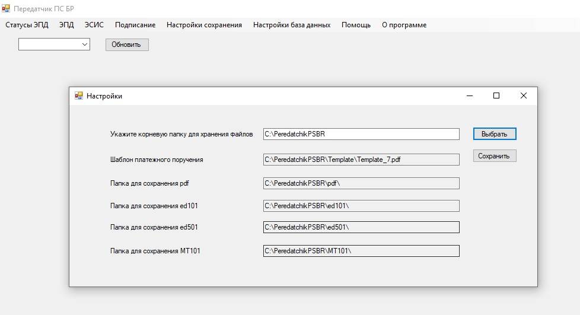
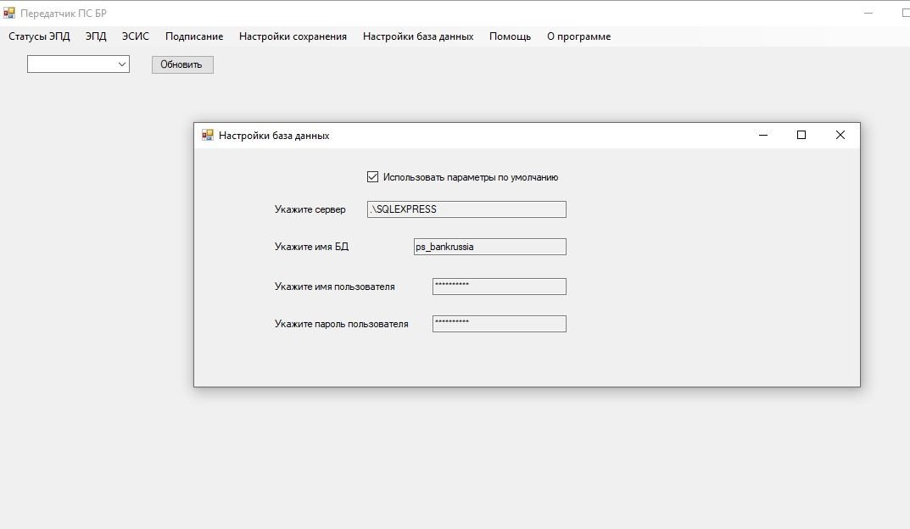
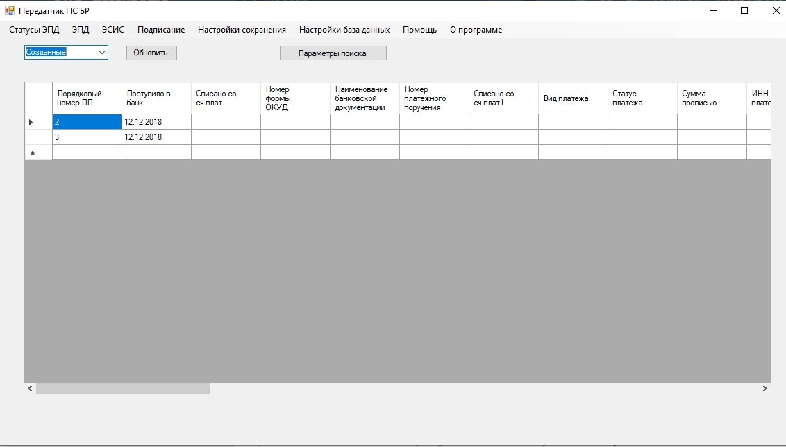

В рамках дипломной работы начал разрабатывать небольшую систему создания, хранения электронных сообщений для АРМ КБР СПФС (автоматизированное рабочее место клиента банка России Системы передачи финансовых сообщений) и АРМ КБР-Н (Автоматизированное рабочее место клиента банка России новое).

Предполагается реализовать следующий функционал:

    создание платежного поручения в формате УФЭБС ED101 для тестового контура АРМ КБР;
    создание платежного поручения в формате УФЭБС ED501 для тестового контура АРМ КБР СПФС;
    создание платежного поручения в формате SWIFT MT101 для тестового контура АРМ КБР СПФС;
    хранение созданных платежных поручений;
    выгрузка платежных поручений в pdf формате;
    обработка принятых входящих сообщений;

Клиент-серверное приложение, язык разработки C#, база данных MS SQL

Форма создания платежного поручения в программе выглядит по форме 0401060 (согласно Приложению 2 Положения Банка России от 19 июня 2012 года № 383-П «О правилах осуществления перевода денежных средств» (в редакции Указаний Банка России от 15.07.2013 № 3025-У, от 29.04.2014 № 3248-У, от 19.05.2015 № 3641-У, от 06.11.2015 N 3844-У, от 05.07.2017 N 4449-У и от 11.10.2018 N 4930-У)

Пункты меню для сохранения платежного поручения

Настройки платежного поручения

Соединение с базой данных

Форма для вывода созданных сообщений автоматизированного рабочего места клиента банка России СПФС (АРМ КБР СПФС)

